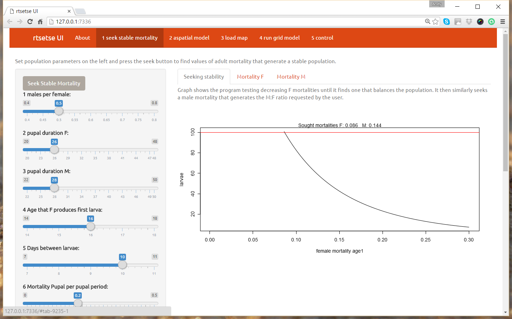
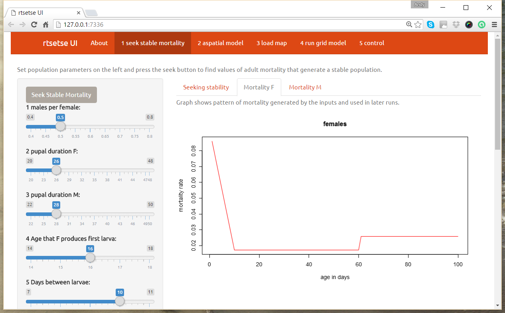
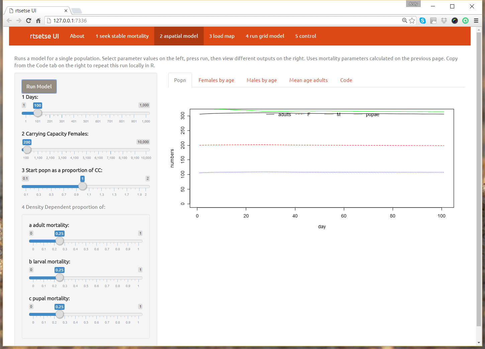
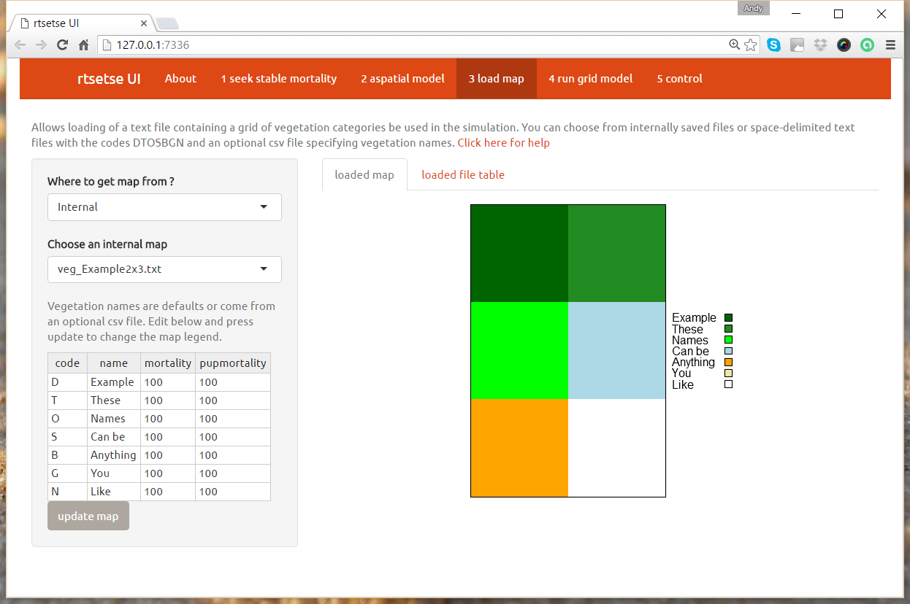
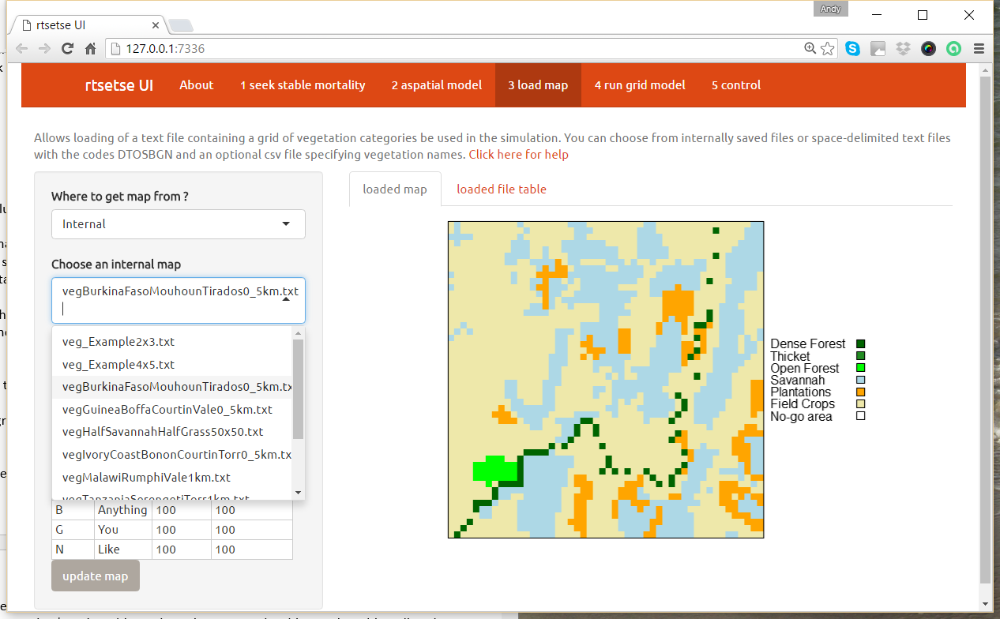
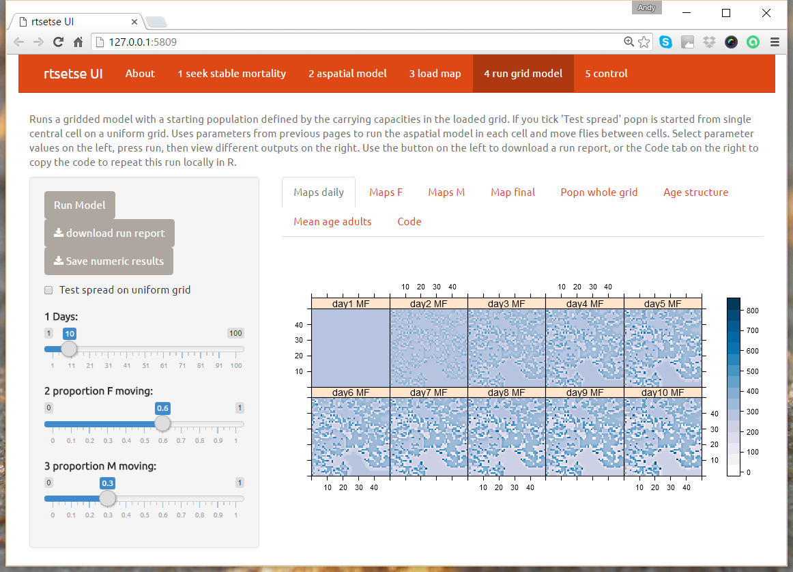
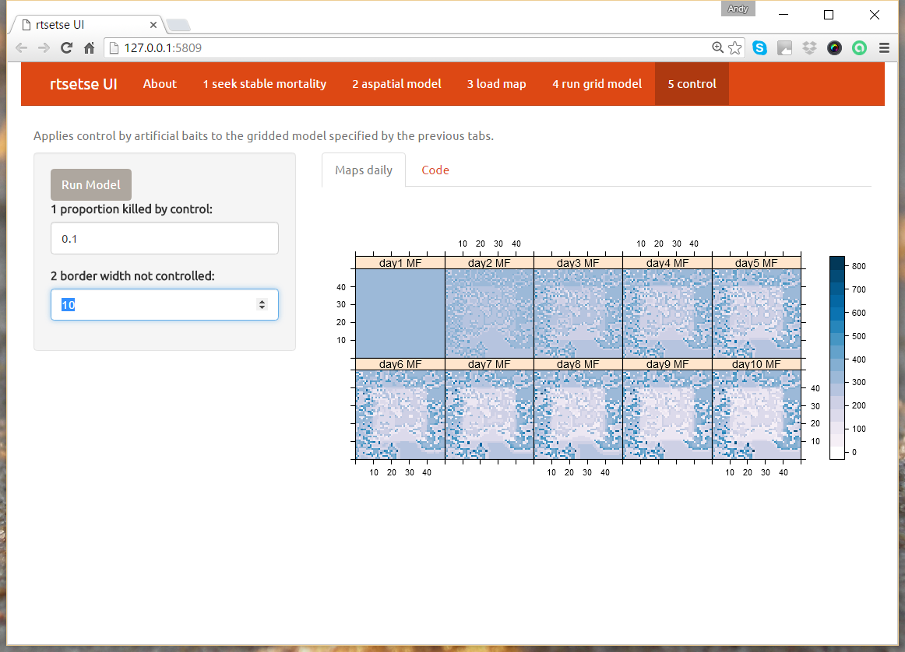

  

```{r global_options, include=FALSE}
#to try to stop figs being moved too much
#didn't seem to make any difference !
#possibly because it's non R figures I'm trying to position
#perhaps I can set an option in the markdown figure call ?
#http://stackoverflow.com/questions/29696172/how-to-hold-figure-position-with-figure-caption-in-pdf-output-of-knitr
knitr::opts_chunk$set(fig.pos = 'H')
```  
  
[rtsetse](https://github.com/AndySouth/rtsetse) is an R package for simulating tsetse fly populations to investigate control options. It follows from [Hat-Trick](http://www.tsetse.org), an Excel Tsetse model.

This document outlines how rtsetse can be used. All text in the grey boxes below can be copied and pasted into the R console (including a simple command to start up a user interface for the model : `rt_UI()`). 

### Installation from R

```{r, eval=FALSE, echo=TRUE, message=FALSE}
require(devtools)    
install_github('AndySouth/rtsetse', build_vignettes=TRUE)  
```
    
### How to run the model, first examples    

```{r, eval=FALSE, echo=TRUE, message=FALSE}
# Load the package in each new R session.
library(rtsetse)
```

### Where to find documentation  

```{r, eval=FALSE, echo=TRUE, message=FALSE}
# This will bring up a brief description of the rtsetse package :
?rtsetse

# Click on 'index' at the bottom of the description page to go to a list of help pages 
# for each function in the package.

```
    
### User Interface
```{r, eval=FALSE, echo=TRUE, message=FALSE}

# to start a graphical user interface 
# with options and buttons allowing the model to be run and outputs to be viewed
rt_UI()
```

The user interface starts with an 'About' screen (Fig. 1) followed by 5 others :


1. seek stable mortality 
    + select population parameters to find adult mortality values that generate stability and will be used in later screens
    + can be skipped to accept default inputs
2. aspatial model
    + runs model for a single randomly-mixed population using inputs from 1.
3. load map
    + load a map from the package or elsewhere to be used in 4 & 5.
4. run grid model
    + run a gridded model using inputs from 1, 2 & 3.
5. control
    + add simple control options to inputs from 1,2,3, & 4


##### UI 1. seek stable mortality
Modify population inputs on the left hand side (Fig. 2), then press the 'Seek Stable Mortality' button at the top. View results on the right hand side, e.g. for mortality by age (Fig. 3).

##### UI 2. aspatial model
Modify inputs on the left hand side (Fig. 4), press the 'Run Model' button. View results on the right hand side, e.g. 'Males by age' to see the number of males in each age class in each day. The 'Code' tab contains code that can be copied and pasted into the R console to recreate this run.    

##### UI 3. load map
Load a map for use in the grid model. Starts with a very small example map (Fig.5). You can select other internal stored maps (Fig. 6) or external maps that you've created yourself. 

There is a link to a helpfile about [creating vegetation maps](helpLoadVegetation.html).

##### UI 4. run grid model
Modify inputs on the left and and press the 'Run Model' button at the top (Fig. 7). The model runs using inputs from this and earlier screens. With the small example map the model should run in seconds, with larger maps for longer time periods it can take minutes or hours. When the model is running the interface will display the message 'Calculation in progress' at the top right. The R console will display progress as 'day [current] of [total]'. After a run, there are 4 ways of looking at the results.

1. view tabs on the right (e.g. 'Maps daily' shown in Fig 8. for one of the internal maps)
2. download a run report using button on left, creates a pdf report of the run
3. save numeric results using button on left, creates a txt file of numeric results (population in time and space)
4. repeat the run in the R console using code copied from the 'Code' tab on the right. Then use `rtsetse` functions to output and display the results in different ways.

##### UI 5. control
Modify inputs on the left and and press the 'Run Model' button at the top. You can select the proportion of flies killed by your control method and a border area where control does not apply. Fig 9. shows the results of applying control of 0.1 with a border area of 10 grid cells to the previous run. 

\pagebreak

### Command Line running

`rtsetse` functions can be run from the R command line giving the user more control.

```{r, eval=FALSE, echo=TRUE, message=FALSE}

# To find documentation about this function and the inputs.
?rt_runGrid

# Click on 'index' at the bottom of the description page to go to a list of help pages 
# for all other functions in the package.

# Set number of days.
iDays <- 10
# Run the model (results are saved to aRecord or any othr object name you choose to use).
aRecord <- 
  rt_runGrid (  pMoveF=0.6,  pMoveM=0.3,   iDays=iDays,  pMortF=0.082,  pMortM=0.139,  
                pMortPupa=0.2,  fStartPopPropCC=1,  iCarryCapF=200,  propMortAdultDD=0.25,  
                iFirstLarva=16,  iInterLarva=10,  pMortLarva=0.05,  propMortLarvaDD=0.25,  
                propMortPupaDD=0.25,  
                mVegCats=system.file("extdata","vegHalfSavannahHalfGrass50x50.txt", 
                                     package="rtsetse"),
                dfMortByVeg=list(code = c("D", "T", "O", "S", "B", "G", "N"), 
                                 name = c("Dense Forest", "Thicket", "Open Forest", 
                                          "Savannah", "Bush", "Grass", "No-go area"), 
                                 mortality = c(200, 150, 110, 100, 110, 210, 999), 
                                 pupmortality = c(120, 110, 105, 100, 120, 170, 999))  )

# Plot some of model results (in this case adult popn across the whole grid).
rtPlotPopGrid(aRecord)
# or plot a map of the population distribution
rtPlotMapPop(aRecord)
# or select particular days, ages and genders
rtPlotMapPop(aRecord, days='final', sex = 'M', age = (20:120))

```

### User Interface screenshots

 

















